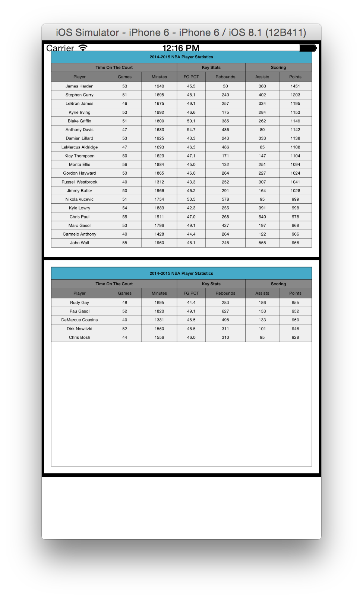

# PDFGrid
Easily create a grid-based PDF document for iOS.

## Motivation
It is still very common in apps for people to want a phsyical document that they can email or save, especially in 
corporate applications. This project will give you a simple way to create a grid, or spreadsheet-like interface.

## Sample Code
```swift

let columnTitles = ["Player", "Games", "Minutes", "FG PCT", "Rebounds", "Assists", "Points"]
var detailValues = [["James Harden", "53", "1940", "45.5", "50", "360", "1451"],
                    ["Stephen Curry", "51", "1695", "48.1", "240", "402", "1203"]]

let document = PDFGridDocument(columnTitles: columnTitles, 
                               detailValues: detailValues, 
                        gridBackgroundColor: rowColor, 
                                   fileName: "NBAStats")
                                   
document.addHeader(0, title: "2014-2015 NBA Player Statistics", 
                     height: 35.0, 
             startingColumn: 0, 
               endingColumn: columnTitles.count-1, 
            backgroundColor: h1Color)
            
document.addHeader(1, title: "Time On The Court", 
                     height: 25.0, 
             startingColumn: 0, 
               endingColumn: 2, 
            backgroundColor: h2Color)
            
document.addHeader(1, title: "Key Stats", 
                     height: 25.0, 
             startingColumn: 3, 
               endingColumn: 4, 
            backgroundColor: h2Color)

document.addHeader(1, title: "Scoring", 
                     height: 25.0, 
             startingColumn: 5, 
               endingColumn: 6, 
            backgroundColor: h2Color)

let filePath = document.generate()
```

## Sample

